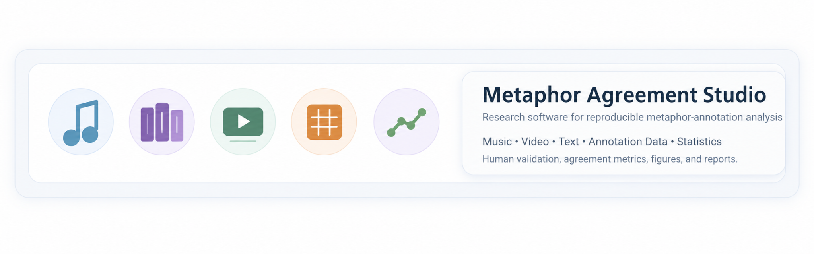

# Metaphor Agreement Studio

[](https://github.com/pdecampossouza/metaphor-agreement-studio/actions/workflows/tests.yml)
[](LICENSE)
[](pyproject.toml)

<p align="center">
  
</p>

**A local-first research environment for reproducible inter-rater agreement analysis in lexical metaphor annotation.**

> Music, video, books, and annotation data — organized into a reproducible metaphor-analysis workflow.

Metaphor Agreement Studio helps researchers inspect annotation workbooks, validate how ratings are encoded, construct a canonical analytical dataset, explore agreement and disagreement, run appropriate inter-rater statistics, and export publication-ready figures and reports. The application is designed for researchers who may not be programmers and keeps methodological choices visible rather than silently converting spreadsheet conventions into data.

## Why this project exists

Metaphor annotation studies frequently begin in spreadsheets. Those workbooks may contain repeated source tables, multiple raters, color-coded decisions, missing values, aggregate tables, spelling variants in grammatical categories, and separate files from new raters. A statistical package can calculate a coefficient correctly and still answer the wrong question if the underlying matrix was assembled incorrectly.

The Studio therefore treats **data identity, human validation, statistical analysis, and reproducibility as one workflow**.

## Main capabilities

- Assisted `.xlsx` / `.xlsm` workbook inspection and table discovery.
- Annotation decoding from text, binary values, and cell fill colors.
- Human confirmation of semantic mappings before analysis.
- Explicit worksheet roles: study data, synthetic/example data, or ignore.
- Occurrence-aware lexical-unit identity and conservative rater alignment.
- Aggregate-source detection to prevent double counting.
- Pairwise observed agreement and **Cohen's Kappa**.
- Multi-rater **Fleiss' Kappa** and complementary **Krippendorff's alpha**, using the Studio's internal nominal-alpha implementation.
- **Cochran's Q** and pairwise **McNemar** tests for classification tendency.
- **Fisher-Freeman-Halton exact tests** for grammatical-category association, with optional low-frequency category exclusion and multiplicity correction.
- No-reference, reference-rater, and expert-benchmark perspectives.
- Interactive and publication-oriented figures with human-readable rater labels.
- Disagreement review linked back to lexical units.
- Reproducible comparison PDFs, Excel/CSV exports, LaTeX helpers, hashes, and project history.
- Local-first execution: source workbooks are not modified and research data are not uploaded to a cloud service by the application.

## Quick start

### Windows

1. Install Python 3.11, 3.12, or 3.13. Python 3.12 is the recommended tested desktop version.
2. Download or clone this repository.
3. Double-click `START_METAPHOR_STUDIO_WINDOWS.bat`.
4. On first use, the launcher creates a local `.venv` and installs dependencies.
5. Keep the launcher window open while using the application.
6. Use `STOP_METAPHOR_STUDIO_WINDOWS.bat` to stop the local server.

### macOS

You can use either the bundled `Metaphor Agreement Studio.app` launcher or `START_METAPHOR_STUDIO_MAC.command`. Because the app is not Apple-notarized, the first launch may require Control-click / right-click -> **Open**.

### Command line

```bash
python -m venv .venv
# Windows
.venv\Scripts\python -m pip install -r requirements-release.txt
.venv\Scripts\python -m streamlit run app.py

# macOS / Linux
.venv/bin/python -m pip install -r requirements-release.txt
.venv/bin/python -m streamlit run app.py
```

## Example workbook

The repository includes an **audited example workbook** at:

`imports/Teste de Concordancia - Revisor Eduardo.xlsx`

It is provided to exercise import, validation, alignment, statistical, and reporting pathways. It is **not a complete doctoral-study dataset and should not be interpreted as the research corpus or as published study results**. See [docs/EXAMPLE_DATA.md](docs/EXAMPLE_DATA.md).


## Working modes

- **Quick Analysis**: open, validate, analyse, and export a workbook without creating a persistent project.
- **Research Project**: preserve immutable source copies, validation decisions, dataset/analysis versions, audit history, and generated artifacts for later resumption.

## Analysis perspectives

- **No reference**: all selected raters are treated symmetrically.
- **Reference rater**: one rater is emphasized for navigation and comparison ordering without being declared ground truth.
- **Expert benchmark**: a deliberately directional perspective that enables benchmark metrics such as sensitivity and specificity.

The original workbook is never modified.

## Statistical scope

The Studio deliberately separates different statistical questions:

- **Agreement:** observed agreement, Cohen's Kappa, Fleiss' Kappa, class-specific agreement, Krippendorff's alpha.
- **Classification tendency:** Cochran's Q and McNemar comparisons.
- **Association with grammatical category:** Fisher-Freeman-Halton exact tests with optional multiple-testing correction.
- **Directional expert comparison:** sensitivity, specificity, precision, recall, and confusion counts only when an expert benchmark is explicitly selected.

See [docs/STATISTICAL_METHODS.md](docs/STATISTICAL_METHODS.md) for the implemented analysis logic and missing-data rules.

## Privacy and research safeguards

- The original workbook is never modified.
- Missing ratings remain missing; they are never silently converted to non-metaphor.
- A reference rater is not treated as ground truth unless **Expert benchmark** is explicitly selected.
- Probable cross-workbook matches require researcher confirmation.
- Synthetic/example worksheets can be retained for software validation while remaining excluded from research statistics.
- Local project databases, logs, generated backups, and user workbooks are excluded from version control by default.

## Development

Install the development dependencies:

```bash
python -m pip install -r requirements-dev-release.txt
```

Run the checks:

```bash
python -m pytest -q
python -m ruff check app.py src tests
```

GitHub Actions runs the same core checks across supported Python versions and desktop operating systems.

If you use `uv`, the equivalent development commands are:

```bash
uv sync
uv run streamlit run app.py
```

## Repository structure

```text
src/metaphor_agreement_studio/   application and research logic
tests/                           automated test suite
imports/                         audited example workbook
assets/                          application styling
.streamlit/                      local Streamlit configuration
docs/                            methodology, architecture, and publication notes
.github/                         CI and contribution templates
```

## Citation

If you use Metaphor Agreement Studio in research, please cite the software using the metadata in [`CITATION.cff`](CITATION.cff). The project metadata lists both software authors and is designed to support a DOI-backed archived release through Zenodo as the public release history matures.

## Open development and publication

This repository is the public development home of the software. Development history, issues, releases, tests, and documentation are intentionally maintained in the open to support reproducibility and future research-software review. See [docs/PUBLICATION_ROADMAP.md](docs/PUBLICATION_ROADMAP.md).

## Authors and contact

**Paulo Vitor de Campos Souza**  
Software architect and project contact  
psouza@novaims.unl.pt

**Bráulio Vidile**  
Research-methodology co-author and domain contact  
brauliovidile@gmail.com

## Contributing and support

See [CONTRIBUTING.md](CONTRIBUTING.md) for development workflow and [SUPPORT.md](SUPPORT.md) for help and bug reports.

## License

Metaphor Agreement Studio is released under the [MIT License](LICENSE).

## Acknowledgment

The software grew from a real lexical-metaphor annotation workflow and from methodological feedback provided by doctoral researchers and evaluators. Their use of the system motivated several safeguards around provenance, worksheet roles, rater selection, disagreement review, and reproducible reporting.
